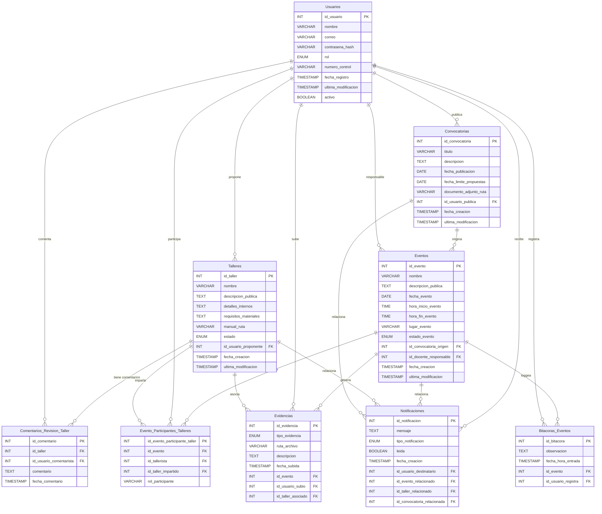

# 📚 AcademicPlus

Sistema web centralizado para la gestión, documentación y seguimiento de eventos académicos y actividades complementarias en instituciones educativas.

---

## 🎯 Descripción del Proyecto

**AcademicPlus** es una plataforma web dirigida a instituciones educativas, enfocada en la organización, inscripción y documentación de talleres y eventos académicos. Resuelve la dispersión de la información y los procesos manuales mediante digitalización y automatización.

---

## 💡 Propósito del Proyecto

- Centralizar la información de talleres y eventos académicos.
- Optimizar el proceso de inscripción y documentación.
- Facilitar la consulta y generación de reportes.

---

## 🌟 Características Clave

- Registro y gestión de usuarios con roles.
- Creación, revisión y aprobación de talleres.
- Registro de evidencias (fotos, videos, reconocimientos).
- Registro y consulta de bitácoras de eventos.
- Generación automática de reportes.
- Visualización de calendario de eventos.
- Notificaciones automatizadas.
- Exportación de datos a Google Drive.

---

## 🧱 Arquitectura del Proyecto

### Modelo
- Clases JPA: `Usuario`, `Taller`, `Evento`, `Evidencia`, `Bitácora`, `Reporte`, `Convocatoria`, `Notificación`.
- Métodos: persistencia de datos, vinculación con otras entidades, validaciones.

### Vista
- Interfaces diseñadas en [Visily](https://app.visily.ai/projects/b7f8607b-8d75-4ca5-a622-8b8ff90dc57c/boards/1767835).
- Interfaz gráfica interactiva con formularios, calendarios y visores de documentos.

### Controlador
- Clases de control por funcionalidad: alta/baja de usuarios, carga de evidencias, reportes, aprobación de talleres.
- Control de sesiones y validación de permisos por rol.

---

## 🛠️ Tecnologías Utilizadas

- **Lenguaje Backend:** Java
- **Frameworks:** Spring Boot / JPA
- **Base de Datos:** MySQL
- **Frontend:** HTML, CSS, JavaScript
- **ORM:** Hibernate / JPA
- **Repositorio de UI:** [Enlace a Visily](https://app.visily.ai/projects/b7f8607b-8d75-4ca5-a622-8b8ff90dc57c)
- **APIs:** Google Drive API para respaldo de datos

---

## ⚙️ Instrucciones para Compilar y Ejecutar

### Prerrequisitos

- JDK 17 o superior
- MySQL Server
- IDE como IntelliJ IDEA o NetBeans
- Maven

# Agregar la continuación del contenido del README en Markdown desde la sección interrumpida

additional_content = """
---

## 🧬 Diseño de la Interacción del Sistema

- La interacción está basada en historias de usuario organizadas por épicas.
- Se utiliza el patrón MVC (Modelo-Vista-Controlador).
- Cada historia cuenta con su propio flujo de uso modelado en diagramas de secuencia.

## 🧾 Historias de Usuario

Cada historia de usuario está documentada con:
- **Identificador**, **Nombre**, **Iteración**, **Peso**
- **Descripción**, **Valor/Aportación**, **Tareas**, **Pruebas de Aceptación**

Puedes consultar todas las historias detalladas en la carpeta `/docs/historias_de_usuario/` o en la sección correspondiente de la documentación del proyecto.

## 🧱 Diseño Detallado de Clases

Las clases del sistema están agrupadas por épicas funcionales y diseñadas con base en fichas CRC. Cada clase incluye:

- Atributos (tipo y visibilidad)
- Métodos (parámetros, retorno y visibilidad)
- Relaciones UML y multiplicidad

Diagramas disponibles en `/design/diagrams/clases.pdf`.

## 🔁 Diagramas de Secuencia

Los diagramas de secuencia ilustran la interacción de objetos para cada funcionalidad clave:

- Autenticar Usuario
- Gestionar Taller
- Aprobar Taller
- Gestionar Evento
- Subir Evidencia
- Generar Reporte
- Notificar Usuario
- Actualizar Perfil
- Publicar Convocatoria
- Asignar Talleristas

Disponibles en `/design/diagrams/`.

## 🧪 Pruebas de Aceptación

Cada historia incluye pruebas que validan la funcionalidad desarrollada. Las pruebas abarcan:

- Creación y validación de usuarios
- Carga y consulta de evidencias
- Flujo de eventos y calendario
- Exportación y seguridad de datos


 

## Diseño de la Base de Datos



## Diseño de la GUI


### 1\. `VentanaLogin.java`

  * **Nombre del Archivo:** `VentanaLogin.java` (Extenderá `javax.swing.JFrame`)

  * **Descripción:**
    Esta ventana será la puerta de entrada al sistema. Permitirá a los usuarios autenticarse ingresando sus credenciales (nombre de usuario o correo y contraseña). Tras una autenticación exitosa, se cerrará y abrirá la `VentanaPrincipal` del sistema, adecuada al rol del usuario.

  * **Funcionamiento:**

    1.  El usuario ingresa su identificador (usuario/email) y contraseña.
    2.  Al presionar el botón "Ingresar", se validarán las credenciales contra la base de datos utilizando `UsuariosJpaController`.
    3.  Si la validación es exitosa, se determina el rol del usuario y se abre la `VentanaPrincipal`.
    4.  Si la validación falla, se muestra un mensaje de error.
    5.  Podría incluir un enlace para la recuperación de contraseña (funcionalidad avanzada).

  * **Elementos de Java Swing:**

      * `JLabel` para "Usuario/Email:", "Contraseña:", y el título de la ventana.
      * `JTextField` para el ingreso del usuario/email.
      * `JPasswordField` para el ingreso de la contraseña.
      * `JButton` para "Ingresar" y posiblemente "Cancelar" o "Salir".
      * `JOptionPane` para mostrar mensajes de error o éxito.

  * **Referencia PlantUML (Salt):**

    ```plantuml
    @startsalt
    {
      {+
        <b>Ventana de Login</b>
      }
      "Usuario/Email:" | <&person> JTextField("Ingrese su usuario")
      "Contraseña:"    | <&key> JPasswordField("********")
      ""               | [ Ingresar ] | [ Salir ]
    }
    @endsalt
    ```

-----

### 2\. `VentanaPrincipal.java`

  * **Nombre del Archivo:** `VentanaPrincipal.java` (Extenderá `javax.swing.JFrame`)

  * **Descripción:**
    Esta es la ventana principal de la aplicación que se muestra después de un inicio de sesión exitoso. Contendrá un menú (`JMenuBar`) desde el cual los usuarios podrán acceder a las diferentes funcionalidades del sistema según su rol (por ejemplo, gestión de usuarios, eventos, talleres, etc.). También podría tener un panel principal para mostrar información general o un dashboard.

  * **Funcionamiento:**

    1.  Se inicializa y se hace visible después de una autenticación exitosa.
    2.  La barra de menú contendrá opciones como "Archivo", "Gestión", "Reportes", "Ayuda".
    3.  Los submenús dentro de "Gestión" (por ejemplo) permitirán abrir los diferentes diálogos de administración (usuarios, eventos, talleres, etc.).
    4.  Las opciones de menú visibles o habilitadas pueden variar según el rol del usuario autenticado.

  * **Elementos de Java Swing:**

      * `JMenuBar` para el menú principal.
      * `JMenu` para cada categoría del menú (ej: "Archivo", "Gestión Usuarios", "Gestión Eventos", "Gestión Talleres", "Convocatorias", "Notificaciones").
      * `JMenuItem` para las acciones específicas dentro de cada menú (ej: "Crear Usuario", "Ver Eventos", "Nueva Convocatoria").
      * `JPanel` (posiblemente `JDesktopPane` si se van a usar `JInternalFrame` para las sub-ventanas, o un panel simple para cambiar vistas).
      * `JLabel` para mostrar información del usuario logueado o un mensaje de bienvenida.

  * **Referencia PlantUML (Salt):**

    ```plantuml
    @startsalt
    {
      {+
        <b>AcademicPlus - Ventana Principal</b>
      }
      {/
        [Archivo] | [Gestión] | [Reportes] | [Ayuda] | Usuario: [NombreUsuario] <&user>
      }
      ....
      .    Contenido Principal / Dashboard       .
      .                                          .
      .                                          .
      .                                          .
      .                                          .
      ............................................
      "Barra de estado: Conectado"
    }
    @endsalt
    ```

    *Nota: El menú "Gestión" se expandiría para mostrar opciones como "Usuarios", "Eventos", etc., que abrirían los JDialogs correspondientes.*

-----

### 3\. `DialogGestionUsuarios.java`

  * **Nombre del Archivo:** `DialogGestionUsuarios.java` (Extenderá `javax.swing.JDialog`)

  * **Descripción:**
    Este diálogo permitirá la administración (Crear, Leer, Actualizar, Eliminar - CRUD) de los usuarios del sistema. Mostrará una lista de usuarios existentes y formularios para agregar nuevos usuarios o modificar los existentes.

  * **Funcionamiento:**

    1.  Al abrirse, carga y muestra la lista de usuarios desde la base de datos usando `UsuariosJpaController`.
    2.  Permite agregar un nuevo usuario a través de un formulario (campos como nombre, apellido, correo, contraseña, rol).
    3.  Permite seleccionar un usuario de la tabla para ver/editar sus detalles o eliminarlo.
    4.  Las operaciones de guardado, actualización y eliminación interactuarán con `UsuariosJpaController`.

  * **Elementos de Java Swing:**

      * `JTable` (`ttUsuarios`) para mostrar la lista de usuarios (columnas: ID, Nombre, Apellido, Email, Rol).
      * `JScrollPane` para la tabla si hay muchos usuarios.
      * `JLabel` y `JTextField` (`txtNombre`, `txtApellido`, `txtEmail`, etc.) para los datos del usuario.
      * `JPasswordField` (`passContrasena`) para la contraseña.
      * `JComboBox` (`cboRol`) para seleccionar el rol del usuario (ej: "Administrador", "Docente", "Estudiante").
      * `JButton` (`btnAgregar`, `btnActualizar`, `btnEliminar`, `btnLimpiarCampos`, `btnCerrar`).

  * **Referencia PlantUML (Salt):**

    ```plantuml
    @startsalt
    {
      {+
        <b>Gestión de Usuarios</b>
      }
      "ID:"         | JTextField("IdUsuario (auto/no editable)")
      "Nombre:"     | JTextField("Nombre del Usuario")
      "Apellido:"   | JTextField("Apellido del Usuario")
      "Email:"      | JTextField("email@ejemplo.com")
      "Contraseña:" | JPasswordField("********")
      "Rol:"        | JComboBox("Administrador", "Docente", "Estudiante")^
      {+
        [ Agregar ] | [ Actualizar ] | [ Eliminar ] | [ Limpiar ]
      }
      --
      {/
        <b>Lista de Usuarios</b>
      }
      [[
      ID  | Nombre     | Apellido   | Email              | Rol
      ... | ...        | ...        | ...                | ...
      ]] (JTable: ttUsuarios)
    }
    @endsalt
    ```

-----

### 4\. `DialogGestionEventos.java`

  * **Nombre del Archivo:** `DialogGestionEventos.java` (Extenderá `javax.swing.JDialog`)

  * **Descripción:**
    Permite la administración completa de los eventos académicos. Los usuarios (probablemente administradores o docentes con permisos) podrán crear nuevos eventos, modificar los existentes, ver detalles y eliminarlos.

  * **Funcionamiento:**

    1.  Muestra una lista de eventos existentes en una `JTable`.
    2.  Formulario para ingresar/editar datos del evento: nombre, descripción, fecha de inicio, fecha de fin, lugar, tipo de evento, estado (ej: "Programado", "En Curso", "Finalizado").
    3.  Botones para CRUD que interactuarán con `EventosJpaController`.
    4.  Podría tener un botón para gestionar participantes o talleres asociados a un evento seleccionado (abriendo otros diálogos).

  * **Elementos de Java Swing:**

      * `JTable` (`tblEventos`) para listar eventos.
      * `JScrollPane` para la tabla.
      * `JLabel` y `JTextField` (`txtNombreEvento`, `txtLugar`).
      * `JTextArea` (`taDescripcionEvento`) para la descripción (dentro de un `JScrollPane`).
      * Componentes para fechas (ej: `JDateChooser` de JCalendar si lo tienes, o `JTextField` con validación).
      * `JComboBox` (`cboTipoEvento`, `cboEstadoEvento`).
      * `JButton` (`btnCrear`, `btnModificar`, `btnEliminar`, `btnVerDetalles`, `btnLimpiar`).

  * **Referencia PlantUML (Salt):**

    ```plantuml
    @startsalt
    {
      {+
        <b>Gestión de Eventos</b>
      }
      "Nombre:"       | JTextField("Nombre del Evento")
      "Descripción:"  | JTextArea("Descripción detallada...")
      "Fecha Inicio:" | JTextField("DD/MM/AAAA") | "Fecha Fin:" | JTextField("DD/MM/AAAA")
      "Lugar:"        | JTextField("Lugar del Evento")
      "Tipo Evento:"  | JComboBox("Conferencia", "Seminario", "Curso")^
      "Estado:"       | JComboBox("Programado", "En Curso", "Finalizado")^
      {+
        [ Crear ] | [ Modificar ] | [ Eliminar ] | [ Limpiar ]
      }
      --
      {/
        <b>Lista de Eventos</b>
      }
      [[
      ID  | Nombre Evento  | Fecha Inicio | Fecha Fin   | Lugar    | Estado
      ... | ...            | ...          | ...         | ...      | ...
      ]] (JTable: tblEventos)
    }
    @endsalt
    ```

-----

### 5\. `DialogGestionTalleres.java`

  * **Nombre del Archivo:** `DialogGestionTalleres.java` (Extenderá `javax.swing.JDialog`)

  * **Descripción:**
    Interfaz para administrar los talleres. Esto incluye crear, editar, ver y eliminar talleres. Los talleres podrían estar asociados a eventos o ser independientes.

  * **Funcionamiento:**

    1.  Presenta una tabla (`JTable`) con los talleres registrados.
    2.  Formulario con campos como: nombre del taller, descripción, ponente/instructor (podría ser un `JComboBox` cargado desde Usuarios con rol "Docente"), cupo máximo, fecha/hora, duración, material requerido, estado (ej: "Propuesto", "Aprobado", "Activo", "Completado").
    3.  Botones CRUD que usarán `TalleresJpaController`.
    4.  Posibilidad de ver/gestionar comentarios o revisiones (`DialogGestionComentariosTaller`).
    5.  Posibilidad de asociar el taller a un evento existente (mediante un `JComboBox` de eventos).

  * **Elementos de Java Swing:**

      * `JTable` (`tblTalleres`).
      * `JScrollPane`.
      * `JLabel` y `JTextField` (`txtNombreTaller`, `txtCupoMaximo`, `txtDuracion`).
      * `JTextArea` (`taDescripcionTaller`).
      * `JComboBox` (`cboPonente`, `cboEventoAsociado`, `cboEstadoTaller`).
      * `JSpinner` o `JTextField` para el cupo.
      * Componentes para fecha/hora.
      * `JButton` (`btnAgregarTaller`, `btnEditarTaller`, `btnEliminarTaller`, `btnVerComentarios`).

  * **Referencia PlantUML (Salt):**

    ```plantuml
    @startsalt
    {
      {+
        <b>Gestión de Talleres</b>
      }
      "Nombre Taller:"   | JTextField("Nombre del Taller")
      "Descripción:"     | JTextArea("Descripción del taller...")
      "Ponente/Instructor:"| JComboBox("Docente A", "Docente B")^
      "Evento Asociado:" | JComboBox("Evento X", "Evento Y", "Ninguno")^
      "Cupo Máximo:"     | JSpinner("25") | "Duración (hrs):" | JTextField("2")
      "Fecha:"           | JTextField("DD/MM/AAAA") | "Hora:" | JTextField("HH:MM")
      "Estado:"          | JComboBox("Propuesto", "Aprobado", "Activo")^
      {+
        [ Agregar ] | [ Editar ] | [ Eliminar ] | [ Comentarios ]
      }
      --
      {/
        <b>Lista de Talleres</b>
      }
      [[
      ID  | Taller          | Ponente    | Evento    | Cupo | Estado
      ... | ...             | ...        | ...       | ...  | ...
      ]] (JTable: tblTalleres)
    }
    @endsalt
    ```

-----

### 6\. `DialogGestionConvocatorias.java`

  * **Nombre del Archivo:** `DialogGestionConvocatorias.java` (Extenderá `javax.swing.JDialog`)

  * **Descripción:**
    Permite crear, visualizar, modificar y eliminar convocatorias para eventos o talleres.

  * **Funcionamiento:**

    1.  Muestra una lista de convocatorias existentes.
    2.  Formulario para datos de la convocatoria: título, descripción, fecha de publicación, fecha límite de inscripción/aplicación, a qué evento/taller se dirige (si aplica), público objetivo.
    3.  Operaciones CRUD utilizando `ConvocatoriasJpaController`.

  * **Elementos de Java Swing:**

      * `JTable` (`tblConvocatorias`).
      * `JScrollPane`.
      * `JLabel` y `JTextField` (`txtTituloConvocatoria`).
      * `JTextArea` (`taDescripcionConvocatoria`).
      * Componentes para fechas (`JDateChooser` o `JTextField`).
      * `JComboBox` (`cboEventoAsociado`, `cboTallerAsociado` - podrían ser opcionales o uno de ellos).
      * `JTextField` o `JTextArea` (`txtPublicoObjetivo`).
      * `JButton` (`btnPublicar`, `btnModificar`, `btnEliminarConvocatoria`).

  * **Referencia PlantUML (Salt):**

    ```plantuml
    @startsalt
    {
      {+
        <b>Gestión de Convocatorias</b>
      }
      "Título:"        | JTextField("Título de la Convocatoria")
      "Descripción:"   | JTextArea("Detalles de la convocatoria...")
      "Fecha Límite:"  | JTextField("DD/MM/AAAA")
      "Para Evento:"   | JComboBox("Evento Alpha", "Ninguno")^
      "Para Taller:"   | JComboBox("Taller Beta", "Ninguno")^
      "Público Obj.:" | JTextField("Estudiantes de Ing.")
      {+
        [ Publicar/Guardar ] | [ Modificar ] | [ Eliminar ]
      }
      --
      {/
        <b>Lista de Convocatorias</b>
      }
      [[
      ID  | Título           | Fecha Límite | Dirigido a
      ... | ...              | ...          | ...
      ]] (JTable: tblConvocatorias)
    }
    @endsalt
    ```

-----

### 7\. `DialogInscripcionEventoTaller.java`

  * **Nombre del Archivo:** `DialogInscripcionEventoTaller.java` (Extenderá `javax.swing.JDialog`)

  * **Descripción:**
    Interfaz para que los usuarios (participantes, como estudiantes) puedan ver los eventos/talleres disponibles (posiblemente filtrados por convocatorias activas) y se inscriban en ellos.

  * **Funcionamiento:**

    1.  Muestra una lista de eventos/talleres disponibles para inscripción. Podría cargar primero las convocatorias activas.
    2.  El usuario selecciona un evento/taller.
    3.  Se muestra información detallada del evento/taller (nombre, descripción, fechas, cupo disponible).
    4.  Un botón "Inscribirme" permitirá al usuario registrarse. Esto crearía un registro en `EventoParticipantesTalleres` o una entidad similar, asociando el `Usuarios` (participante) con el `Eventos` o `Talleres`.
    5.  Se deben manejar validaciones (ej: no exceder cupo, no inscribirse dos veces, cumplir requisitos de convocatoria).

  * **Elementos de Java Swing:**

      * `JList` o `JTable` (`lstEventosDisponibles` o `tblTalleresDisponibles`) para mostrar los eventos/talleres.
      * `JScrollPane`.
      * `JTextArea` o `JPanel` con `JLabel`s para mostrar los detalles del evento/taller seleccionado.
      * `JButton` (`btnInscribirme`, `btnVerMisInscripciones`).
      * `JLabel` para mostrar el cupo disponible vs. el total.

  * **Referencia PlantUML (Salt):**

    ```plantuml
    @startsalt
    {
      {+
        <b>Inscripción a Eventos/Talleres</b>
      }
      "Eventos/Talleres Disponibles:"
      [[
      Nombre                      | Fecha      | Cupo Disp.
      Taller de Java Avanzado     | 20/05/2025 | 10/25
      Conferencia IA              | 25/05/2025 | 80/100
      ...                         | ...        | ...
      ]] (JList o JTable) | {+ <b>Detalles:</b>
                            Nombre: [Nombre Seleccionado]
                            Desc:   [Descripción Larga...]
                            Fecha:  [Fecha Seleccionada]
                            Lugar:  [Lugar Seleccionado]
                            Cupo:   [Cupo Info]
                            [ Inscribirme ]
                          }
      --
      [ Ver mis Inscripciones ]
    }
    @endsalt
    ```

-----

### 8\. `DialogGestionEvidencias.java`

  * **Nombre del Archivo:** `DialogGestionEvidencias.java` (Extenderá `javax.swing.JDialog`)

  * **Descripción:**
    Permite a los usuarios (participantes o instructores) subir y gestionar evidencias relacionadas con talleres o eventos. Las evidencias podrían ser archivos (documentos, imágenes, etc.).

  * **Funcionamiento:**

    1.  El usuario selecciona el taller o evento para el cual desea gestionar evidencias (podría venir preseleccionado si se accede desde otra ventana).
    2.  Muestra una lista de evidencias ya subidas para ese contexto.
    3.  Un botón "Subir Evidencia" abrirá un `JFileChooser` para seleccionar un archivo.
    4.  Campos para describir la evidencia (título, comentario).
    5.  La información de la evidencia (nombre archivo, ruta quizás, tipo, usuario que la subió, fecha, descripción) se guarda usando `EvidenciasJpaController`.
    6.  Permite descargar o eliminar evidencias (con permisos adecuados).

  * **Elementos de Java Swing:**

      * `JLabel` para indicar el Taller/Evento.
      * `JTable` (`tblEvidencias`) para listar las evidencias subidas (columnas: Nombre Archivo, Descripción, Fecha Subida, Usuario).
      * `JScrollPane`.
      * `JTextField` (`txtTituloEvidencia`).
      * `JTextArea` (`taDescripcionEvidencia`).
      * `JButton` (`btnSeleccionarArchivo`, `btnSubirEvidencia`, `btnDescargarEvidencia`, `btnEliminarEvidencia`).
      * `JFileChooser` para la selección de archivos.

  * **Referencia PlantUML (Salt):**

    ```plantuml
    @startsalt
    {
      {+
        <b>Gestión de Evidencias para: [Nombre Taller/Evento]</b>
      }
      "Título Evidencia:" | JTextField("Título...")
      "Descripción:"      | JTextArea("Comentarios adicionales...")
      "Archivo:"          | JTextField("ruta/del/archivo.pdf (no editable)") [ Examinar... ]
      {+
        [ Subir Evidencia ]
      }
      --
      {/
        <b>Evidencias Subidas</b>
      }
      [[
      Archivo          | Descripción      | Fecha Subida | Subido por
      tarea1.pdf       | Primera entrega  | 10/05/2025   | usuario_x
      ...              | ...              | ...          | ...
      ]] (JTable: tblEvidencias)
      {+
        [ Descargar Seleccionada ] | [ Eliminar Seleccionada ]
      }
    }
    @endsalt
    ```

-----

### Consideraciones Adicionales:

  * **`DialogGestionComentariosRevisionTaller.java`:** Para ver y añadir comentarios a los talleres, utilizando `ComentariosRevisionTallerJpaController`. Podría ser accesible desde `DialogGestionTalleres`.
  * **`DialogVerNotificaciones.java`:** Una ventana simple (quizás no un diálogo modal completo) para mostrar notificaciones al usuario, utilizando `NotificacionesJpaController`.
  * **`DialogVerBitacoras.java`:** Para administradores, para ver los registros de `BitacorasEventosJpaController`.
  * **Clases Base o Utilitarias:** Podrías considerar crear una clase base para tus diálogos de gestión si comparten mucha funcionalidad común (ej. botones CRUD estándar, manejo de tablas).
  * **Modelos de Tabla Personalizados:** Al igual que en tu ejemplo `MTtutor.java`, necesitarás crear `AbstractTableModel` personalizados para cada `JTable` para manejar correctamente los datos de tus entidades y permitir una mejor visualización y manipulación. Por ejemplo, `ModeloTablaUsuarios`, `ModeloTablaEventos`, etc.
  * **Internacionalización (i18n):** Si planeas que tu aplicación soporte múltiples idiomas, considera usar archivos de propiedades para los textos de etiquetas, botones, etc.
  * **Look and Feel:** Ya estás usando FlatLaf en tu ejemplo, lo cual es excelente para una apariencia moderna.
