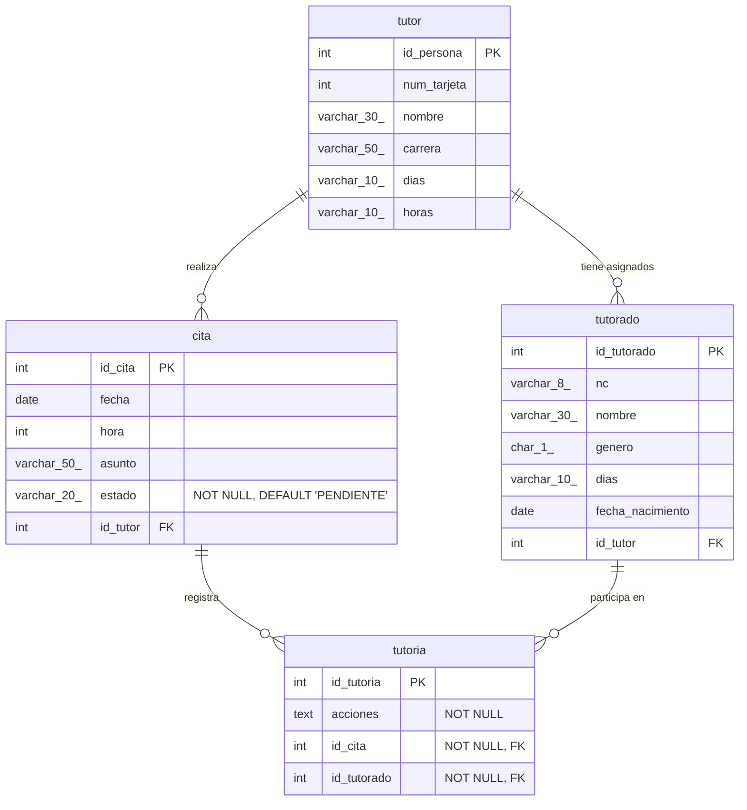

# Sistema de Gestión de Tutorías Académicas (SGTA)

## Video Demostrativo
De click sobre la Imagen.

## Descripción

El Sistema de Gestión de Tutorías Académicas (SGTA) es una aplicación de escritorio desarrollada en Java Swing, diseñada para administrar eficientemente el proceso de tutorías en una institución educativa. Permite gestionar la información de coordinadores, tutores y tutorados, así como la programación de citas, el registro de las sesiones de tutoría y el seguimiento de las acciones derivadas.

La aplicación ofrece diferentes interfaces y funcionalidades adaptadas a los roles de Coordinador, Tutor y Tutorado, centralizadas a través de un menú principal (`IMenu.java`) y ventanas de diálogo o formularios específicos para cada tarea de gestión.

## Diseño de la Base de Datos

## Características Principales

El sistema se organiza en torno a los siguientes módulos y funcionalidades accesibles principalmente a través de `IMenu.java`:

### Módulo de Administrador (Coordinador)
* **Panel de Control General (`panelAdmControl`):**
    * Visualización en tablas de todos los Tutores registrados (`tabAdmTutores`).
    * Visualización de todos los Estudiantes/Tutorados registrados (`tabAdmEstudiantes`).
    * Visualización de todas las Citas creadas en el sistema (`tabAdmCitas`).
    * Visualización de todas las Tutorías realizadas (`tabAdmTutorias`).
* **Gestión de Tutores:**
    * **Agregar Tutor (`panelAdmAgregarTutor` o abriendo `ITutor.java`):** Permite registrar nuevos tutores, especificando número de tarjeta, nombre completo, carrera de adscripción, y sus días/horas de disponibilidad. Incluye selección de imagen para el tutor.
    * **Asignar Tutor a Tutorados (`panelAdmAsignarTutor`):** Interfaz para seleccionar un tutor y luego asignar tutorados (estudiantes sin tutor) de una lista de disponibles a una lista de asignados para ese tutor, usando un componente `DualListTransfer`.
    * (Funcionalidad implícita o a través de `ITutor.java`): Edición y eliminación de tutores.
* **Gestión de Tutorados (`IPTutorado.java`):**
    * Registro, edición y eliminación de tutorados, incluyendo número de control, nombre, género, días disponibles, fecha de nacimiento y asignación de tutor.
* **Gestión de Citas (`IPCita.java`):**
    * Creación, edición y eliminación de citas, especificando fecha, hora, asunto, estado (PENDIENTE, REALIZADA, CANCELADA) y el tutor asignado.
* **Gestión de Tutorías (Registrar/Consultar - `ITutoria.java` o `IPTutoria.java`):**
    * Interfaz para que el coordinador o tutor registre el resultado de una tutoría, basada en una cita previa. Implica seleccionar una fecha (con `JDateChooser`), luego una cita de esa fecha, listar los tutorados del tutor de esa cita, marcar asistencia y registrar acciones.

### Módulo de Tutor
* Acceso a funcionalidades para gestionar sus citas y registrar tutorías.
    * **Crear Citas** (probablemente abriendo una versión de `IPCita.java`).
    * **Realizar Tutoría** (probablemente abriendo una versión de `ITutoria.java` filtrada para sus datos).

### Módulo de Tutorado
* **Ver Citas (`panelVerCitas`):** Permite a un tutorado buscar y visualizar sus citas programadas ingresando su número de control.

### Características Generales
* **Inicio de Sesión (`ILogin.java`):** Diferencia entre usuarios Coordinador, Tutor y Tutorado para dar acceso a las funcionalidades correspondientes.
* **Interfaz Gráfica Moderna:** Uso de la librería FlatLaf (FlatMacDarkLaf / FlatArcOrangeIJTheme / FlatLightLaf) para mejorar la apariencia visual.
* **Componentes Personalizados:** Uso de `JDateChooser` para selección de fechas y `DualListTransfer` para asignaciones.

## Tecnologías Utilizadas

* **Lenguaje:** Java (Versión 8 - JDK 1.8)
* **IDE:** Apache NetBeans
* **GUI:** Java Swing
    * **Look and Feel:** FlatLaf (temas como FlatMacDarkLaf, FlatArcOrangeIJTheme, FlatLightLaf)
    * **Componentes Adicionales:** JCalendar (para `JDateChooser`), `elements.DualListTransfer`
* **Persistencia:** Java Persistence API (JPA) con EclipseLink como proveedor.
* **Base de Datos:** MySQL (conector `mysql-connector-java-8.0.17.jar`)
* **Sistema Operativo (Desarrollo):** Windows 11

## Estructura del Proyecto

El proyecto sigue una estructura típica de NetBeans, separando el código fuente en paquetes:

* `src/control/`: Contiene los JpaControllers generados para cada entidad (`TutorJpaController`, `CitaJpaController`, etc.), una clase `AdmDatos` para gestionar el `EntityManagerFactory`, y excepciones personalizadas.
* `src/modelo/`: Incluye las clases de entidad JPA (`Tutor.java`, `Cita.java`, `Tutorado.java`, `Tutoria.java`) y los modelos de tabla personalizados (`MTtutor.java`, `MTcita.java`, `MTablaCita.java`, etc.).
* `src/vista/`: Contiene todas las clases de la interfaz gráfica de usuario (JFrames, JDialogs como `IMenu.java`, `ILogin.java`, `IPCita.java`, etc.).
* `src/imagenes/` y `src/vista/imagenes/`: Carpetas para los recursos gráficos utilizados en la aplicación.
* `src/META-INF/persistence.xml`: Archivo de configuración de la unidad de persistencia de JPA.
* `lib/`: Directorio con las librerías JAR necesarias para el proyecto (EclipseLink, MySQL Connector, FlatLaf, JCalendar, etc.).

## Requisitos Previos

* JDK 8 o superior.
* Servidor de base de datos MySQL.
* Apache NetBeans IDE (versión compatible con Java 8 y las librerías usadas).

## Configuración y Ejecución

1.  **Base de Datos:**
    * Crea una base de datos en tu servidor MySQL (p.ej., `tutorias_db`).
    * Ejecuta el script SQL `tutorias_db.sql` (o el script DDL correspondiente) para crear la estructura de tablas necesaria.
    * Verifica y ajusta la configuración de conexión en `src/META-INF/persistence.xml` para que coincida con tu servidor MySQL (URL, usuario, contraseña de la base de datos). La unidad de persistencia se llama `tutoriasPU`.
2.  **Proyecto en NetBeans:**
    * Clona este repositorio o descarga el código fuente.
    * Abre el proyecto en NetBeans IDE.
    * Asegúrate de que todas las librerías JAR en la carpeta `lib/` estén correctamente añadidas a las "Libraries" del proyecto. NetBeans suele manejar esto si las librerías están presentes en la carpeta `lib` del proyecto y `nblibraries.properties` está configurado.
3.  **Construir y Ejecutar:**
    * Realiza un "Clean and Build" del proyecto en NetBeans.
    * Ejecuta la clase principal, que probablemente sea `vista.ILogin` para iniciar sesión, la cual luego abrirá `vista.IMenu` según el rol del usuario.

## Flujo de Sesión

1.  **Inicio de Sesión (`ILogin.java`):**
    * El usuario selecciona su tipo ("Coordinador", "Tutor", "Tutorado").
    * Ingresa sus credenciales (usuario y contraseña).
    * Coordinador: Usuario "Admin", Contraseña "Admin" (hardcodeado).
    * Tutor: Usuario (nombre o número de tarjeta), Contraseña (número de tarjeta).
    * Tutorado: Usuario (nombre o número de control), Contraseña (número de control).
2.  **Menú Principal (`IMenu.java`):**
    * Dependiendo del rol, se muestran diferentes pestañas y funcionalidades:
        * **Coordinador:** Acceso a las pestañas "Tutorado" (para ver citas de tutorados), "Administrador" (para control general y gestión de tutores/asignaciones) y "Tutor" (para crear citas y registrar tutorías, actuando en nombre de tutores o con una vista global).
        * **Tutor:** (Después de la adaptación de `IMenu` para este rol) Acceso a la pestaña "Tutor" para crear citas y registrar sus tutorías. Se ocultan las pestañas "Tutorado" y "Administrador".
        * **Tutorado:** (Después de la adaptación de `IMenu` para este rol) Acceso a la pestaña "Tutorado" para ver sus citas. Se ocultan las pestañas "Administrador" y "Tutor".
3.  **Operaciones:**
    * El coordinador puede navegar entre las diferentes pestañas para gestionar entidades.
    * La pestaña "Tutoria" en `IMenu.java` o una ventana `ITutoria.java` separada (si se lanza desde `IMenu`) permite registrar las asistencias y acciones de una tutoría.

